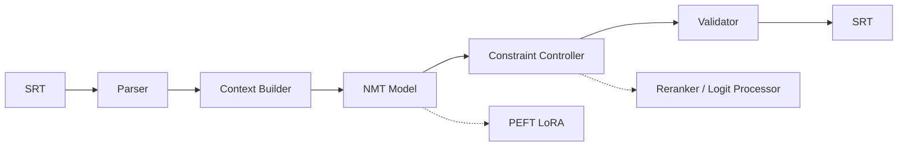

# subtitle-ai-engine

Multi-objective constraint-aware NMT for educational subtitle localization.

## Setup

```bash
uv sync
```

Or with mise: `mise install && mise run setup`

## Usage

### Quick start (auto-detect language + model)

```bash
uv run pipeline input.srt --output translated.srt
```

Detects the SRT language and routes to the right model. Currently supports:
- `en` → `hi` via `Helsinki-NLP/opus-mt-en-hi`
- `hi` → `en` via `Helsinki-NLP/opus-mt-hi-en`

### Explicit language / model

```bash
uv run pipeline input.srt --output translated.srt --src-lang en --tgt-lang hi
uv run pipeline input.srt --output translated.srt --model Helsinki-NLP/opus-mt-en-fr
```

### Constraint-aware decoding

```bash
uv run pipeline input.srt --output translated.srt --constrained-decoding --max-cpl 42
```

### Other tools

Train a PEFT adapter:

```bash
uv run train-peft --train-file data/train.jsonl --output-dir my-adapter
```

Evaluate:

```bash
uv run evaluate --reference ref.srt --hypothesis hyp.srt
```

Preprocess:

```bash
uv run preprocess input.srt --output clean.srt --max-cpl 42
```

## CLI reference

| Flag | Default | Description |
|------|---------|-------------|
| `--model` | `auto` | HF model name or `auto` for language-aware resolution |
| `--src-lang` | `""` | Source language short code (e.g. `en`, `hi`) |
| `--tgt-lang` | `""` | Target language short code (e.g. `hi`, `en`) |
| `--max-cpl` | `42` | Max characters per subtitle line |
| `--max-cps` | `21` | Max characters per second |
| `--constrained-decoding` | off | Use CPL logit processor instead of reranking |

## Adding more language pairs

Extend `PAIR_MODELS` in `src/subtitle_nmt_thesis/pipeline/run.py`:

```python
PAIR_MODELS = {
    ("en", "hi"): "Helsinki-NLP/opus-mt-en-hi",
    ("hi", "en"): "Helsinki-NLP/opus-mt-hi-en",
    # add your pair here
}
```

## Architecture


