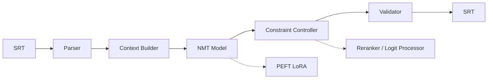

# subtitle-ai-engine

Multi-objective constraint-aware NMT for educational subtitle localization.

## Setup

```bash
uv sync
```

Or with mise: `mise install && mise run setup`

## Run the React frontend and Python backend

The UI is a Vite + React application in `src/ui`. The translation pipeline stays
in Python and is exposed through the standard-library JSON API in
`src/subtitle_nmt_thesis/api.py`. Streamlit is no longer used.

### 1. Install Python dependencies

From the repository root:

```powershell
uv sync
```

If the local uv-managed Python runtime is unavailable, install Python 3.11+
and run the equivalent commands with your Python executable.

### 2. Start the backend

In terminal 1:

```powershell
uv run backend
```

The API listens on [http://127.0.0.1:8000](http://127.0.0.1:8000).
You can change the port with `SUBTITLE_API_PORT=8001`.

### 3. Start the React frontend

In terminal 2:

```powershell
cd src/ui
npm install
npm run dev
```

Open [http://localhost:5173](http://localhost:5173) in your browser.
Vite proxies `/api` requests to the Python backend automatically.

The **Model playground** calls the real `/api/translate` endpoint. The first
translation can take longer because the Hugging Face model may need to download
and load into memory. The backend keeps the loaded pipeline in memory, so later
requests with the same model and language pair avoid that startup cost. CPU mode
works by default; CUDA is used automatically when a compatible PyTorch
installation and GPU are available.

### Production preview

```powershell
cd src/ui
npm run build
npm run preview
```

Stop either process with `Ctrl+C` in its terminal.

## Usage

### Quick start (auto-detect language + model)

```bash
uv run pipeline input.srt --output translated.srt
```

Detects the SRT language and routes to the right model. Currently supports:
- `en` → `hi` via `Helsinki-NLP/opus-mt-en-hi`
- `hi` → `en` via `Helsinki-NLP/opus-mt-hi-en`

### Explicit language / model

```bash
uv run pipeline input.srt --output translated.srt --src-lang en --tgt-lang hi
uv run pipeline input.srt --output translated.srt --model Helsinki-NLP/opus-mt-en-fr
```

### Constraint-aware decoding

```bash
uv run pipeline input.srt --output translated.srt --constrained-decoding --max-cpl 42
```

### Other tools

Train a PEFT adapter:

```bash
uv run train-peft --train-file data/train.jsonl --output-dir my-adapter
```

Evaluate:

```bash
uv run evaluate --reference ref.srt --hypothesis hyp.srt
```

Preprocess:

```bash
uv run preprocess input.srt --output clean.srt --max-cpl 42
```

## CLI reference

| Flag | Default | Description |
|------|---------|-------------|
| `--model` | `auto` | HF model name or `auto` for language-aware resolution |
| `--src-lang` | `""` | Source language short code (e.g. `en`, `hi`) |
| `--tgt-lang` | `""` | Target language short code (e.g. `hi`, `en`) |
| `--max-cpl` | `42` | Max characters per subtitle line |
| `--max-cps` | `21` | Max characters per second |
| `--constrained-decoding` | off | Use CPL logit processor instead of reranking |

## Adding more language pairs

Extend `PAIR_MODELS` in `src/subtitle_nmt_thesis/pipeline/run.py`:

```python
PAIR_MODELS = {
    ("en", "hi"): "Helsinki-NLP/opus-mt-en-hi",
    ("hi", "en"): "Helsinki-NLP/opus-mt-hi-en",
    # add your pair here
}
```

## Architecture


```mermaid
flowchart LR
    A[SRT] --> B[Parser]
    B --> C[Context Builder]
    C --> D[NMT Model]
    D --> E[Constraint Controller]
    E --> F[Validator]
    F --> G[SRT]
    D -.-> H[PEFT LoRA]
    E -.-> I[Reranker / Logit Processor]
```
